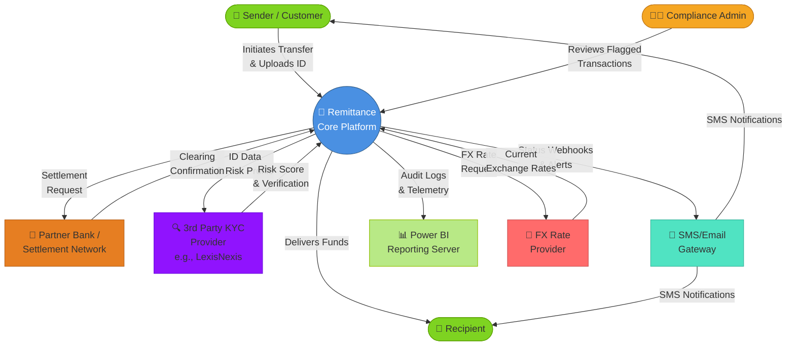

# 🏗️ System Context Diagram (Level 0)

This diagram outlines the system boundaries of the Remittance Platform and its integration points with external actors and third-party services.

---

## System Context Overview

---

## Data Flows & Integration Points

### **1. Customer Onboarding & Transaction Initiation**
- **Source:** Mobile App / Web Portal
- **Flow:** Sender submits transfer request with personal info and ID documents
- **Target System:** Remittance Core Platform
- **Validation:** User registration, device fingerprinting, session management
- **Output:** Transaction ID + Status (INITIATED)

---

### **2. KYC & Compliance Verification**
- **Source:** Remittance Core Platform
- **Flow:** User documents (ID, Passport) sent to LexisNexis API
- **Target System:** 3rd Party KYC Provider
- **Processing:** OCR, document validation, biometric matching
- **Output:** Risk Score (0-100), Verification Status (APPROVED/PENDING/REJECTED)
- **Timeline:** 30 seconds to 2 hours depending on risk level

---

### **3. Funds Settlement**
- **Source:** Remittance Core Platform
- **Flow:** Approved transactions routed to partner bank for clearing
- **Target System:** Partner Bank Settlement Network
- **Protocol:** ISO 20022 XML over SFTP / API
- **Confirmation:** Clearing reference, settlement timestamp
- **Output:** Status = SETTLED or FAILED

---

### **4. Real-Time Status Notifications**
- **Source:** Transaction_Events table in Core Platform
- **Flow:** Events triggered by system state changes (KYC cleared, settlement confirmed)
- **Target System:** SMS/Email Gateway
- **Delivery:** SMS (primary), Email (backup)
- **Latency:** < 60 seconds from event trigger to notification delivery

---

### **5. Analytics & Compliance Reporting**
- **Source:** Audit tables (Transactions, KYC_Records, Transaction_Events)
- **Flow:** Nightly ETL extracts data snapshots
- **Target System:** Power BI Data Warehouse
- **Metrics:** Transaction volume, KYC approval rates, compliance flags, FX margins
- **Refresh:** Daily (02:00 UTC)

---

## System Boundaries

### **Inside the Remittance Platform:**
✅ User registration & identity verification  
✅ Risk-based transaction routing  
✅ Real-time transaction tracking  
✅ Compliance rule enforcement  
✅ Audit logging & data persistence  

### **Outside the Platform (Integrated via API):**
❌ KYC document processing (delegated to LexisNexis)  
❌ Funds settlement (delegated to Partner Banks)  
❌ SMS delivery (delegated to Twilio/AWS SNS)  
❌ Exchange rate feeds (delegated to FX provider)  
❌ BI reporting interface (delegated to Power BI)  

---

## Key Design Principles

| Principle | Implementation | Benefit |
| :--- | :--- | :--- |
| **Separation of Concerns** | Each external system handles its domain (KYC, banking, comms) | Reduced coupling; easier to swap providers |
| **Asynchronous Processing** | KYC checks & settlements run in background queues | Faster user feedback; improved resilience |
| **Webhook-Based Notifications** | Status updates pushed to clients via webhooks | Real-time visibility; reduced polling |
| **Audit Logging** | All events logged in Transaction_Events table | Compliance, troubleshooting, fraud detection |
| **Graceful Degradation** | If SMS gateway is down, fall back to email | Continued operation; reduced user impact |

---

## Technology Stack

| Component | Technology | Rationale |
| :--- | :--- | :--- |
| **API Gateway** | Kong / AWS API Gateway | Rate limiting, authentication, request routing |
| **Backend Services** | Node.js / Spring Boot microservices | Event-driven, scalable, polyglot support |
| **Message Queue** | RabbitMQ / AWS SQS | Async transaction processing, dead-letter handling |
| **Primary Database** | PostgreSQL | ACID compliance, JSON support for flexible schemas |
| **Caching Layer** | Redis | FX rates, user session state, leaderboard caching |
| **Search Index** | Elasticsearch | Full-text transaction search for compliance audit |
| **Monitoring** | Datadog / New Relic | Real-time alerts, performance tracking, SLA compliance |

---

## Non-Functional Requirements

| Requirement | Target | Rationale |
| :--- | :--- | :--- |
| **Availability** | 99.95% uptime SLA | Customer-critical; regulatory reporting |
| **Latency** | p99 < 500ms for transaction initiation | User-facing; competitive UX |
| **Settlement SLA** | 95% settled within 2 hours | Market standard for remittance corridors |
| **Data Redundancy** | Multi-region active-active | Disaster recovery; geographic compliance |
| **Encryption** | AES-256 at rest, TLS 1.3 in transit | POPIA, data protection regulations |

---

## Future Integration Points (Roadmap)

🚀 **Blockchain Settlement** – Direct peer-to-peer transfers bypassing traditional banking  
🚀 **Stablecoin Corridors** – USDC settlement for faster clearing  
🚀 **Mobile Money Integration** – Direct MTN Mobile Money / Vodacom M-Pesa settlement  
🚀 **Open Banking APIs** – PSD2-compliant data sharing for linked account verification
