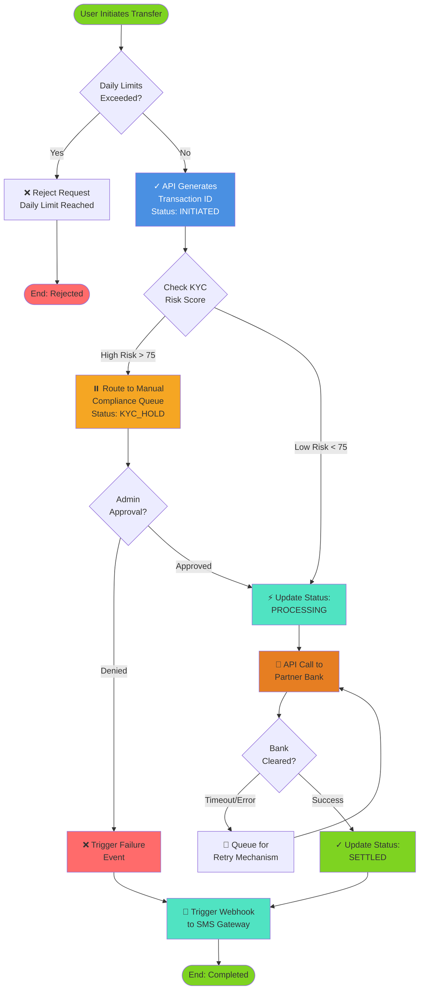
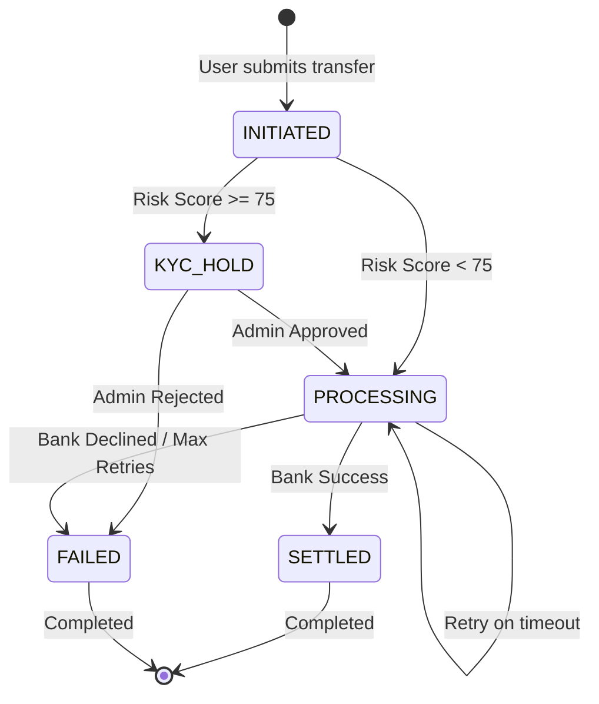

# 🔄 Transaction Processing Flow (To-Be Architecture)

This sequence maps the event-driven lifecycle of a remittance transaction, highlighting the automated compliance routing and exception handling.

---

## High-Level Transaction Lifecycle

---

## Detailed Step-by-Step Flow

### **Step 1: User Initiates Transfer**
| Field | Value |
| :--- | :--- |
| **Trigger** | User clicks "Send Money" in mobile app |
| **Input Data** | Sender ID, Recipient ID, Amount, Currency |
| **Validation** | Check sender & recipient exist; verify sender has sufficient balance |
| **Output** | If valid: proceed to Step 2; If invalid: return 400 error |

---

### **Step 2: Transaction Created (Status: INITIATED)**
| Field | Value |
| :--- | :--- |
| **Action** | API endpoint `/api/v1/transactions/initiate` receives request |
| **Processing** | Generate unique TransactionID (UUID); Log event to Transaction_Events |
| **Database Insert** | INSERT into Transactions table with CurrentStatus = 'INITIATED' |
| **Response** | Return HTTP 202 with TransactionID and "under review" message |
| **Next Step** | Async process: Retrieve sender's KYC risk score |

---

### **Step 3: KYC Risk Assessment**
| Field | Value |
| :--- | :--- |
| **Trigger** | Background job polls transaction queue every 500ms |
| **Action** | Query KYC_Records table for sender's RiskScore |
| **Decision Logic** | If RiskScore < 75: proceed to Step 4 (Auto-settle); If RiskScore >= 75: proceed to Step 3B (Manual review) |
| **Timeout** | If KYC data unavailable after 2 seconds, default to RiskScore = 100 (High Risk) |

---

### **Step 3B: Manual Compliance Review (High-Risk Path)**
| Field | Value |
| :--- | :--- |
| **Trigger** | RiskScore >= 75 detected |
| **Action** | Update Transaction status to 'KYC_HOLD'; Send alert to Compliance_Queue |
| **Notification** | Email to compliance_team@remittance-platform.com with transaction details |
| **Reviewer Dashboard** | Compliance officer logs into admin portal, reviews sender's KYC documents |
| **Decision Options** | **APPROVE:** Proceed to Step 4 | **REJECT:** Notify sender; move to Step 6 |
| **SLA** | Compliance review must complete within 4 business hours |

---

### **Step 4: Validate & Process Payment (Auto/Manual Path)**
| Field | Value |
| :--- | :--- |
| **Precondition** | RiskScore < 75 OR Admin has approved |
| **Action** | Update Transaction status to 'PROCESSING' |
| **FX Conversion** | Query FX provider for real-time exchange rate; apply platform margin (+2.5%) |
| **Calculate Fees** | Fee = Amount × 2% (e.g., ZAR 5,000 → ZAR 100 fee) |
| **Settlement Payload** | Construct ISO 20022 XML message with transaction details |
| **API Call** | POST to Partner Bank settlement endpoint with message |
| **Timeout** | Wait maximum 30 seconds for bank response; if timeout → proceed to Step 4B |

---

### **Step 4B: Settlement Retry Logic**
| Field | Value |
| :--- | :--- |
| **Trigger** | Bank API times out or returns 500 error |
| **Retry Count** | Exponential backoff: 2 sec → 5 sec → 10 sec (max 3 attempts) |
| **Queue** | Place transaction in DLQ (Dead Letter Queue) after 3 failures |
| **Notification** | Alert ops team; manual intervention required |
| **Status Update** | Keep Transaction status = 'PROCESSING' until final resolution |

---

### **Step 5: Settlement Confirmation (Success Path)**
| Field | Value |
| :--- | :--- |
| **Trigger** | Partner Bank returns HTTP 200 with clearing reference |
| **Processing** | Parse bank response; extract settlement timestamp & reference number |
| **Update Database** | UPDATE Transactions SET CurrentStatus = 'SETTLED', SettlementReference = '<bank_ref>' |
| **Event Log** | INSERT into Transaction_Events: EventStatus = 'SETTLED', TriggeredBy = 'SYSTEM' |
| **Recipient Notification** | Async webhook call: POST to recipient's registered callback URL |
| **SMS Delivery** | Queue SMS to both sender & recipient: "Money transferred successfully" |

---

### **Step 6: Settlement Failure & Notifications**
| Field | Value |
| :--- | :--- |
| **Trigger** | Admin rejects transaction OR bank decline after retries |
| **Action** | Update Transaction status to 'FAILED'; Insert failure event with reason code |
| **Reason Codes** | COMPLIANCE_REJECTION, DAILY_LIMIT_EXCEEDED, INSUFFICIENT_FUNDS, BANK_DECLINED |
| **Sender Notification** | SMS: "Your transfer was declined. Reason: <reason>. Contact support." |
| **Refund Processing** | If payment was collected, credit sender's account within 24 hours |
| **Audit Trail** | Log who rejected, reason, timestamp for compliance review |

---

## Event State Machine

---

## Real-Time Event Tracking Example

**Transaction ID:** `tx_5592-abcd-1234`

| Event # | Timestamp | Event Status | Description | Triggered By |
| :--- | :--- | :--- | :--- | :--- |
| 1 | 2026-07-02 08:00:15 | INITIATED | Transaction created via mobile app | API |
| 2 | 2026-07-02 08:00:16 | KYC_ASSESSED | Risk Score: 42 (Low Risk) | SYSTEM |
| 3 | 2026-07-02 08:00:17 | PROCESSING | Routed to settlement | SYSTEM |
| 4 | 2026-07-02 08:01:03 | SETTLEMENT_SENT | Bank API call initiated | SYSTEM |
| 5 | 2026-07-02 08:02:45 | SETTLED | Settlement cleared successfully | SYSTEM |
| 6 | 2026-07-02 08:02:46 | NOTIFICATION_SENT | SMS sent to sender & recipient | SYSTEM |

---

## Performance Targets & SLAs

| Metric | Target | Tolerance |
| :--- | :--- | :--- |
| **Time to PROCESSING** | < 2 seconds | p95: 1.5s, p99: 3s |
| **Time to SETTLED** | 95% within 2 hours | p99: 4 hours |
| **Compliance Review** | 4 business hours (manual) | SLA: 8 hours max |
| **Notification Delivery** | < 60 seconds | p99: 120 seconds |
| **Database Write Latency** | < 100ms | p99: 200ms |

---

## Error Handling & Resilience

### **Circuit Breaker Pattern**
If Partner Bank API fails 5 times in 60 seconds:
- Stop sending requests for 30 seconds
- Automatically retry after cooldown
- Alert ops team for manual intervention

### **Idempotency**
All API calls include `idempotency_key` header to prevent duplicate settlements if requests are replayed.

### **Dead Letter Queue (DLQ)**
Transactions that fail after max retries are parked in DLQ for manual inspection by engineering team.

---

## Compliance & Audit Requirements

✅ All state transitions logged to Transaction_Events table  
✅ Admin approvals captured with user ID + timestamp  
✅ Bank settlement confirmations stored for 7 years (regulatory requirement)  
✅ Daily reconciliation reports auto-generated and sent to FIC  
✅ Transaction event audit trail exportable for compliance reviews
