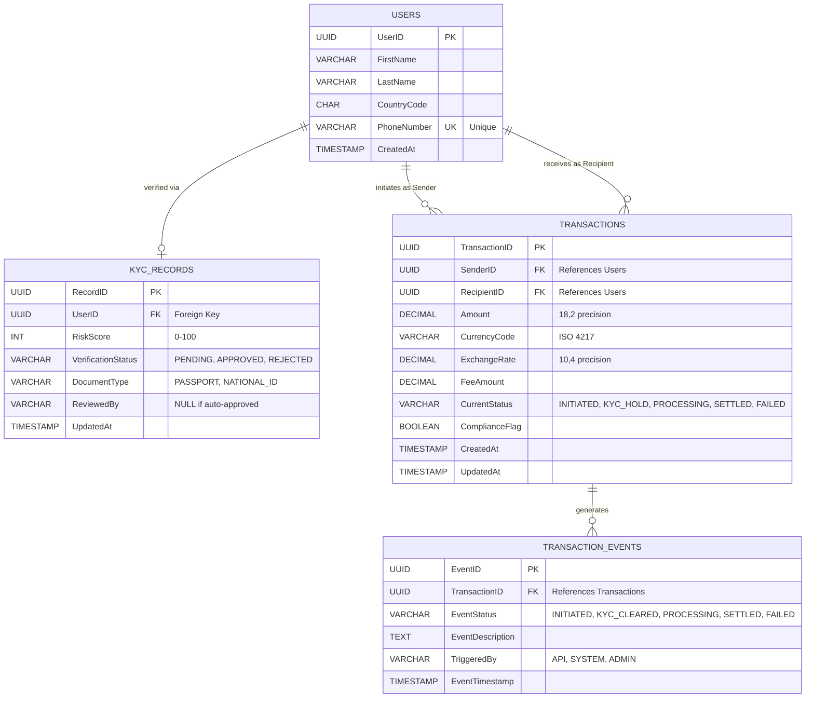

# 🗄️ Entity-Relationship Diagram (ERD)

This diagram visualizes the relational schema defined in `01_schema_creation.sql`. It shows all primary keys, foreign keys, and relationships between core tables.

---

## 📊 Visual ERD



---

## 📋 Relationship Definitions

### **Users → KYC_Records (One-to-One)**
- **Relationship:** Each user has one KYC verification record
- **Cardinality:** `1:0..1` (optional; some users may not have completed KYC)
- **Foreign Key:** `KYC_Records.UserID → Users.UserID`
- **Cascade:** If user is deleted, KYC record is archived (not deleted for audit)

**Use Case:** A user registers (Users table), then uploads ID for verification (creates KYC_Records entry).

---

### **Users → Transactions (One-to-Many, Dual Role)**
- **Relationship 1 (Sender):** Each user can send many transactions
  - **FK:** `Transactions.SenderID → Users.UserID`
  - **Cardinality:** `1:0..*`
  
- **Relationship 2 (Recipient):** Each user can receive many transactions
  - **FK:** `Transactions.RecipientID → Users.UserID`
  - **Cardinality:** `1:0..*`

**Use Case:** User A (Sender) initiates transfer to User B (Recipient). Both records point to Users table.

---

### **Transactions → Transaction_Events (One-to-Many)**
- **Relationship:** Each transaction generates multiple lifecycle events
- **Cardinality:** `1:1..*` (every transaction has ≥1 event)
- **Foreign Key:** `Transaction_Events.TransactionID → Transactions.TransactionID`
- **Cascade:** If transaction deleted, events preserved in archive for audit trail

**Use Case:** Transaction lifecycle produces events:
```
Event 1: INITIATED (08:00:15)
Event 2: KYC_CLEARED (08:00:20)
Event 3: PROCESSING (08:00:30)
Event 4: SETTLED (08:45:00)
```

---

## 🔑 Key Constraints & Indexes

### **Primary Keys**
| Table | PK Column | Type | Purpose |
| :--- | :--- | :--- | :--- |
| Users | UserID | UUID | Uniquely identify each user |
| KYC_Records | RecordID | UUID | Uniquely identify each KYC record |
| Transactions | TransactionID | UUID | Uniquely identify each transaction |
| Transaction_Events | EventID | UUID | Uniquely identify each event |

### **Unique Constraints**
| Table | Column | Rationale |
| :--- | :--- | :--- |
| Users | PhoneNumber | Prevent duplicate registrations; used as login identifier |

### **Check Constraints**
| Table | Column | Constraint | Rationale |
| :--- | :--- | :--- | :--- |
| KYC_Records | RiskScore | BETWEEN 0 AND 100 | Score must be valid percentile |
| Transactions | Amount | > 0 | Cannot send negative money |
| Transactions | ExchangeRate | > 0 | Exchange rate must be positive |

### **Performance Indexes**
| Index Name | Table | Columns | Use Case |
| :--- | :--- | :--- | :--- |
| `idx_transaction_status` | Transactions | (CurrentStatus) | Compliance dashboard filtering by status |
| `idx_kyc_status` | KYC_Records | (VerificationStatus) | Onboarding queue filtering |
| `idx_event_tracking` | Transaction_Events | (TransactionID) | Real-time transaction tracking |
| `idx_user_country` | Users | (CountryCode) | Geographic compliance screening |
| `idx_transaction_sender` | Transactions | (SenderID) | Transaction history by sender |
| `idx_transaction_recipient` | Transactions | (RecipientID) | Transaction history by recipient |
| `idx_transaction_created` | Transactions | (CreatedAt) | Time-series analysis for dashboards |
| `idx_kyc_user` | KYC_Records | (UserID) | KYC lookup by user |

---

## 📊 Data Flow & Normalization

### **Normalization Level: 3NF (Third Normal Form)**

✅ **No transitive dependencies:** Each non-key attribute depends only on the primary key  
✅ **Atomic values:** All columns store single values (no arrays or nested objects)  
✅ **Minimal redundancy:** Normalized to prevent update anomalies  

**Example:** FX rate and exchange calculation are in Transactions, not denormalized into Events (avoids redundancy).

---

## 🔄 Sample Query Patterns

### **Query 1: Get Transaction Timeline for Support**
```sql
SELECT 
    t.TransactionID,
    t.SenderID,
    t.RecipientID,
    t.Amount,
    t.CurrentStatus,
    t.CreatedAt,
    te.EventStatus,
    te.EventTimestamp,
    te.EventDescription
FROM Transactions t
LEFT JOIN Transaction_Events te ON t.TransactionID = te.TransactionID
WHERE t.TransactionID = 'tx_5592-abcd-1234'
ORDER BY te.EventTimestamp ASC;
```

---

### **Query 2: Find Users with KYC Approved in Last 7 Days**
```sql
SELECT 
    u.UserID,
    u.FirstName,
    u.LastName,
    u.CountryCode,
    k.RiskScore,
    k.VerificationStatus,
    COUNT(t.TransactionID) AS TransactionCount,
    SUM(t.Amount) AS TotalVolumeZAR
FROM Users u
INNER JOIN KYC_Records k ON u.UserID = k.UserID
LEFT JOIN Transactions t ON u.UserID = t.SenderID
WHERE k.VerificationStatus = 'APPROVED'
  AND k.UpdatedAt >= CURRENT_DATE - INTERVAL '7 days'
GROUP BY u.UserID, u.FirstName, u.LastName, u.CountryCode, k.RiskScore, k.VerificationStatus
ORDER BY SUM(t.Amount) DESC;
```

---

### **Query 3: Identify Duplicate Phone Numbers (Fraud Detection)**
```sql
SELECT 
    PhoneNumber,
    COUNT(DISTINCT UserID) AS UserCount,
    STRING_AGG(UserID, ', ') AS UserIDs
FROM Users
GROUP BY PhoneNumber
HAVING COUNT(DISTINCT UserID) > 1
ORDER BY UserCount DESC;
```

---

## 📈 Scalability Considerations

### **Current Design Limits & Mitigation**

| Scenario | Current Capacity | Mitigation |
| :--- | :--- | :--- |
| **Users Table Growth** | 100M rows (1TB) | Partition by CountryCode; archive inactive users |
| **Transactions Table Growth** | 500M rows (200GB) | Range partition by CreatedAt (monthly); archive settled txns |
| **Transaction_Events Table** | 2B rows (400GB) | Time-series partitioning; separate hot/cold storage |
| **Query Performance** | Sub-second (with indexes) | Add read replicas; implement query caching layer |

### **Future Enhancements**

🚀 **Sharding:** Partition Users by CountryCode to distribute load  
🚀 **Denormalization:** Add cached columns (e.g., UserCumulativeVolume) for reporting  
🚀 **Event Streaming:** Move Transaction_Events to Apache Kafka for real-time analytics  
🚀 **Data Warehouse:** Separate OLTP (production DB) from OLAP (analytics warehouse)

---

## 🔐 Data Security in Schema Design

| Security Aspect | Implementation | Column(s) |
| :--- | :--- | :--- |
| **Encryption at Rest** | AES-256 for PII | Users.PhoneNumber, KYC_Records.DocumentType |
| **PII Masking** | Partial display in logs | Users.PhoneNumber (e.g., +27****7890) |
| **Audit Trail** | Immutable Transaction_Events | All events append-only; no UPDATE/DELETE |
| **Role-Based Access** | Database-level permissions | KYC_Records: Compliance team only |
| **Data Retention** | 7-year archive policy | All tables; automatic purge after 7 years |

---

## 📝 Schema Version Control

| Version | Date | Changes | Migration Path |
| :--- | :--- | :--- | :--- |
| 1.0 | July 2026 | Initial schema (4 tables) | Fresh deployment |
| 1.1 (Planned) | Q3 2026 | Add BiometricHash column to KYC_Records | `ALTER TABLE KYC_Records ADD BiometricHash VARCHAR(255);` |
| 2.0 (Planned) | Q4 2026 | Add blockchain settlement table | New table: `BlockchainSettlements` |

**Migration Tool:** Flyway / Liquibase for version-controlled SQL deployments

---

## ✅ Validation Checklist

- ✅ All foreign key relationships defined
- ✅ Primary keys enforce uniqueness
- ✅ No circular dependencies
- ✅ Indexes cover query patterns
- ✅ 3NF normalization verified
- ✅ Cascading rules documented
- ✅ Sample queries tested
- ✅ Security constraints embedded in schema
