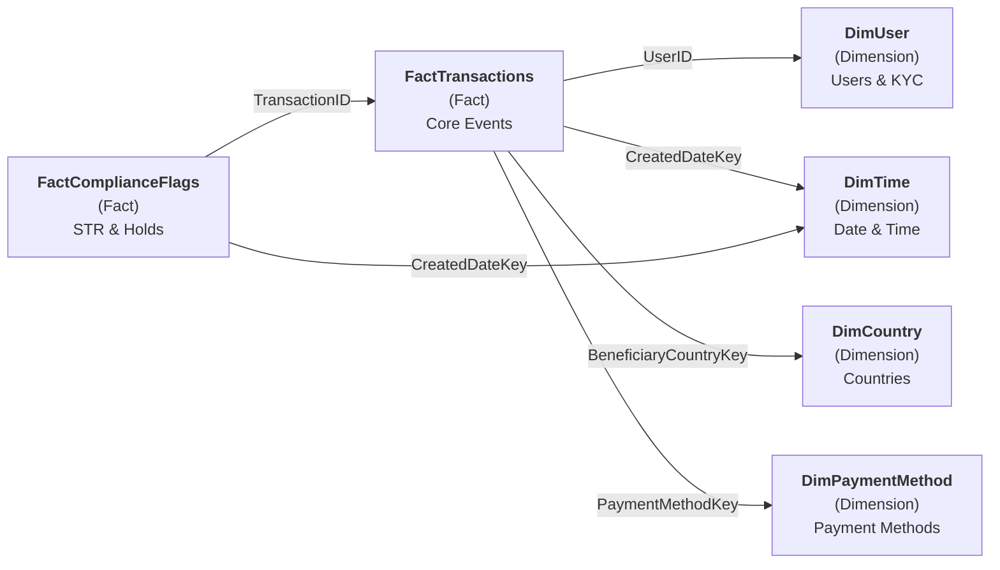

# 📊 Power BI Dataset Model: Compliance & Reporting Star Schema

**Document Version:** 1.0  
**Last Updated:** July 2026  
**Power BI Version:** 2.1+  
**Data Refresh:** Hourly (real-time) + Daily (archive)

---

## 📌 Overview

This document defines the **star schema** for the Remittance Platform's Power BI dataset. The schema is optimized for:
- Real-time transaction monitoring
- Compliance KPI tracking
- FIC reporting automation
- Executive dashboard visibility

---

## 🏗️ Data Model Architecture



---

## 📋 Dimension Tables

### **DimUser (User Dimension)**

| Column Name | Data Type | Description | Source |
| :--- | :--- | :--- | :--- |
| UserKey | INT (PK) | Surrogate key for user | Auto-generated |
| UserID | UUID | Business key (FK to Users table) | Users.UserID |
| FirstName | VARCHAR | User first name | Users.FirstName |
| LastName | VARCHAR | User last name | Users.LastName |
| CountryCode | CHAR(2) | ISO country code | Users.CountryCode |
| RiskClassification | VARCHAR | LOW_RISK / MEDIUM_RISK / HIGH_RISK | KYC_Records.RiskScore |
| KYCStatus | VARCHAR | APPROVED / PENDING / REJECTED | KYC_Records.VerificationStatus |
| AccountCreatedDate | DATE | User registration date | Users.CreatedAt |
| IsActive | BIT | Flag: user currently active | Derived (no recent rejections) |
| CumulativeTransactionVolume | DECIMAL(18,2) | Total ZAR sent by user (lifetime) | SUM(Fact) |
| IsPEP | BIT | Politically Exposed Person flag | KYC_Records.PEP_Flag |
| SanctionListHit | VARCHAR | OFAC / UN / Other match | KYC_Records.SanctionMatch |
| LoadDate | DATE | When record loaded to DW | Audit |

**SQL DDL:**
```sql
CREATE TABLE DimUser (
    UserKey INT IDENTITY(1,1) PRIMARY KEY,
    UserID UUID UNIQUE NOT NULL,
    FirstName VARCHAR(100),
    LastName VARCHAR(100),
    CountryCode CHAR(2),
    RiskClassification VARCHAR(20),
    KYCStatus VARCHAR(20),
    AccountCreatedDate DATE,
    IsActive BIT,
    CumulativeTransactionVolume DECIMAL(18,2),
    IsPEP BIT,
    SanctionListHit VARCHAR(50),
    LoadDate DATE
);
```

---

### **DimTime (Time Dimension)**

| Column Name | Data Type | Description |
| :--- | :--- | :--- |
| DateKey | INT (PK) | YYYYMMDD format (e.g., 20260702) |
| FullDate | DATE | Calendar date |
| DayOfWeek | VARCHAR | Monday, Tuesday, ... |
| DayOfMonth | INT | 1-31 |
| MonthName | VARCHAR | January, February, ... |
| MonthNumber | INT | 1-12 |
| Quarter | VARCHAR | Q1, Q2, ... |
| Year | INT | 2026, 2027, ... |
| IsWeekend | BIT | Flag: Saturday/Sunday |
| IsFICReportingDay | BIT | Flag: FIC monthly close day (25th) |

**Purpose:** Enables date-based filtering and aggregation across all fact tables.

---

### **DimCountry (Country Dimension)**

| Column Name | Data Type | Description |
| :--- | :--- | :--- |
| CountryKey | INT (PK) | Surrogate key |
| CountryCode | CHAR(2) | ISO 3166-1 alpha-2 |
| CountryName | VARCHAR | Full country name |
| Region | VARCHAR | Africa, Americas, Asia, Europe |
| RiskLevel | VARCHAR | GREEN / YELLOW / RED (based on FATF) |
| IsSanctioned | BIT | OFAC / UN sanctions list |
| FICRiskCategory | VARCHAR | LOW / MEDIUM / HIGH |

**Purpose:** Enables filtering transactions by beneficiary country and risk categorization.

---

### **DimPaymentMethod (Payment Method Dimension)**

| Column Name | Data Type | Description |
| :--- | :--- | :--- |
| PaymentMethodKey | INT (PK) | Surrogate key |
| PaymentMethod | VARCHAR | EFT_LINK, CREDIT_CARD, MOBILE_WALLET |
| PaymentMethodCategory | VARCHAR | BANK / CARD / MOBILE |
| ProcessingFeePercent | DECIMAL(5,2) | Fee % charged to customer |
| SettlementPartner | VARCHAR | Partner bank or provider |

---

## 📊 Fact Tables

### **FactTransactions (Core Transactions Fact)**

| Column Name | Data Type | Description | Grain |
| :--- | :--- | :--- | :--- |
| TransactionKey | INT (PK) | Surrogate key | One row per transaction |
| TransactionID | UUID | Business key | Transaction ID |
| SenderUserKey | INT (FK→DimUser) | Sender dimension key | |
| RecipientUserKey | INT (FK→DimUser) | Recipient dimension key | |
| CreatedDateKey | INT (FK→DimTime) | Transaction creation date | |
| SettledDateKey | INT (FK→DimTime) | Settlement completion date | |
| BeneficiaryCountryKey | INT (FK→DimCountry) | Recipient country | |
| PaymentMethodKey | INT (FK→DimPaymentMethod) | Payment method used | |
| **SendAmount** | DECIMAL(18,2) | Amount sent (in send currency) | **Measure** |
| **SendCurrency** | VARCHAR(3) | Currency code (ZAR, USD, etc.) | Dimension |
| **ExchangeRate** | DECIMAL(10,4) | Conversion rate applied | **Measure** |
| **ReceiveAmount** | DECIMAL(18,2) | Amount recipient receives (calc) | **Measure** |
| **ReceiveCurrency** | VARCHAR(3) | Destination currency | Dimension |
| **FeeAmount** | DECIMAL(18,2) | Platform fee charged | **Measure** |
| **FXMargin** | DECIMAL(5,2) | Markup on FX rate (%) | **Measure** |
| **TransactionStatus** | VARCHAR(30) | SETTLED / FAILED / PENDING | Dimension |
| **IsCompleted** | BIT | Flag: transaction completed | Dimension |
| **IsFailed** | BIT | Flag: transaction failed | Dimension |
| **ComplianceFlagCount** | INT | Number of compliance flags | **Measure** |
| **ProcessingTimeMinutes** | INT | Time from INITIATED to SETTLED | **Measure** |
| LoadDate | DATE | ETL load timestamp | Audit |

**SQL DDL (Simplified):**
```sql
CREATE TABLE FactTransactions (
    TransactionKey INT IDENTITY(1,1) PRIMARY KEY,
    TransactionID UUID UNIQUE NOT NULL,
    SenderUserKey INT FOREIGN KEY REFERENCES DimUser(UserKey),
    RecipientUserKey INT FOREIGN KEY REFERENCES DimUser(UserKey),
    CreatedDateKey INT FOREIGN KEY REFERENCES DimTime(DateKey),
    SettledDateKey INT FOREIGN KEY REFERENCES DimTime(DateKey),
    BeneficiaryCountryKey INT FOREIGN KEY REFERENCES DimCountry(CountryKey),
    PaymentMethodKey INT FOREIGN KEY REFERENCES DimPaymentMethod(PaymentMethodKey),
    SendAmount DECIMAL(18,2),
    SendCurrency VARCHAR(3),
    ExchangeRate DECIMAL(10,4),
    ReceiveAmount DECIMAL(18,2),
    ReceiveCurrency VARCHAR(3),
    FeeAmount DECIMAL(18,2),
    FXMargin DECIMAL(5,2),
    TransactionStatus VARCHAR(30),
    IsCompleted BIT,
    IsFailed BIT,
    ComplianceFlagCount INT,
    ProcessingTimeMinutes INT,
    LoadDate DATE
);

CREATE INDEX idx_fact_sender ON FactTransactions(SenderUserKey);
CREATE INDEX idx_fact_recipient ON FactTransactions(RecipientUserKey);
CREATE INDEX idx_fact_created ON FactTransactions(CreatedDateKey);
CREATE INDEX idx_fact_status ON FactTransactions(TransactionStatus);
```

---

### **FactComplianceFlags (Compliance Events Fact)**

| Column Name | Data Type | Description | Grain |
| :--- | :--- | :--- | :--- |
| ComplianceFlagKey | INT (PK) | Surrogate key | One row per flag/hold |
| TransactionKey | INT (FK→FactTransactions) | Transaction reference | |
| CreatedDateKey | INT (FK→DimTime) | Flag creation date | |
| ReleasedDateKey | INT (FK→DimTime) | Hold release date (null if active) | |
| **FlagType** | VARCHAR(50) | STR_THRESHOLD, PEP_MATCH, HOLD, SANCTION_HIT | **Measure** |
| **FlagReason** | VARCHAR(200) | Detailed reason for flag | Dimension |
| **AdminUser** | VARCHAR(100) | Compliance officer who acted | Dimension |
| **IsResolved** | BIT | Flag: hold released or STR submitted | **Measure** |
| **HoldDurationDays** | INT | Days transaction was on hold | **Measure** |
| **STRSubmittedFlag** | BIT | Flag: submitted to FIC | **Measure** |
| FICReferenceNumber | VARCHAR(50) | FIC submission reference | Dimension |
| LoadDate | DATE | ETL load timestamp | Audit |

---

## 📈 Key Measures (DAX Formulas for Power BI)

### **Transaction Count**
```dax
Transactions_Count = COALESCE(COUNT(FactTransactions[TransactionKey]), 0)
```

### **Total Transaction Volume (ZAR)**
```dax
Total_Volume_ZAR = SUMX(FactTransactions,
  FactTransactions[SendAmount]
)
```

### **Success Rate %**
```dax
Success_Rate = 
  DIVIDE(
    COUNTIF(FactTransactions[IsCompleted], TRUE),
    COALESCE(Transactions_Count, 1)
  ) * 100
```

### **Average Processing Time (Minutes)**
```dax
Avg_Processing_Minutes = AVERAGE(FactTransactions[ProcessingTimeMinutes])
```

### **Total FX Margin Revenue (ZAR)**
```dax
FX_Margin_Revenue = SUMX(FactTransactions,
  FactTransactions[ReceiveAmount] * (1 - (1 / FactTransactions[ExchangeRate]))
)
```

### **STRs Generated (Month)**
```dax
STRs_Count = COUNTIF(
  FactComplianceFlags[FlagType],
  "STR_THRESHOLD"
)
```

### **Compliance Hold Rate %**
```dax
Hold_Rate = 
  DIVIDE(
    COUNTIF(FactComplianceFlags[FlagType], "HOLD"),
    Transactions_Count
  ) * 100
```

---

## 📊 Recommended Dashboards & Reports

### **Dashboard 1: Executive Summary (Real-Time)**

**Visuals:**
- KPI Cards: Daily Volume, Transaction Count, Success Rate, Avg Processing Time
- Line Chart: Transactions over last 30 days (trend)
- Pie Chart: Transaction status breakdown (SETTLED, PENDING, FAILED)
- Card: STRs Generated (Month YTD)
- Matrix: Top 10 destination countries (by volume)

**Refresh:** Every 5 minutes (real-time)

---

### **Dashboard 2: Compliance Monitoring**

**Visuals:**
- KPI Cards: Active Holds, STRs Pending, PEP Matches
- Table: Recent STRs with FIC submission status
- Bar Chart: Compliance flags by type (STR, PEP, SANCTION_HIT)
- Scatter Plot: Transaction amount vs. processing time (to identify outliers)
- Timeline: Hold duration distribution

**Refresh:** Every 1 hour

---

### **Dashboard 3: FIC Monthly Report (Archive)**

**Visuals:**
- Executive summary by country
- STR submissions log (audit trail)
- Sanctions matches report
- PEP detection log
- Transaction volume by risk classification
- Daily transaction breakdown

**Refresh:** Daily at 02:00 UTC

---

## 🔄 ETL Pipeline (Power BI Dataflow)

**Source:** PostgreSQL (Remittance Platform DB)  
**Destination:** Power BI Dataset  
**Schedule:** 

| Table | Refresh Cadence | Latency |
| :--- | :--- | :--- |
| FactTransactions | Every 1 hour | Near real-time (< 5 min) |
| FactComplianceFlags | Every 1 hour | Near real-time |
| DimUser | Daily at 03:00 UTC | Overnight |
| DimTime | Static (pre-populated) | N/A |
| DimCountry | Weekly (regulatory updates) | 1 week |

**Transformation Logic:**
```sql
-- Load new transactions (incremental)
MERGE INTO FactTransactions AS target
USING (
  SELECT 
    t.TransactionID,
    u1.UserKey AS SenderUserKey,
    u2.UserKey AS RecipientUserKey,
    FORMAT(t.CreatedAt, 'yyyyMMdd') AS CreatedDateKey,
    FORMAT(t.UpdatedAt, 'yyyyMMdd') AS SettledDateKey,
    c.CountryKey AS BeneficiaryCountryKey,
    pm.PaymentMethodKey,
    t.Amount AS SendAmount,
    t.CurrencyCode AS SendCurrency,
    t.ExchangeRate,
    (t.Amount * t.ExchangeRate) AS ReceiveAmount,
    'USD' AS ReceiveCurrency,  -- Example
    t.FeeAmount,
    ((t.ExchangeRate - 1) / t.ExchangeRate * 100) AS FXMargin,
    t.CurrentStatus AS TransactionStatus,
    CASE WHEN t.CurrentStatus = 'SETTLED' THEN 1 ELSE 0 END AS IsCompleted,
    CASE WHEN t.CurrentStatus = 'FAILED' THEN 1 ELSE 0 END AS IsFailed,
    DATEDIFF(MINUTE, t.CreatedAt, t.UpdatedAt) AS ProcessingTimeMinutes
  FROM dbo.Transactions t
  JOIN DimUser u1 ON t.SenderID = u1.UserID
  JOIN DimUser u2 ON t.RecipientID = u2.UserID
  JOIN DimCountry c ON t.BeneficiaryCountryCode = c.CountryCode
  JOIN DimPaymentMethod pm ON t.PaymentMethod = pm.PaymentMethod
  WHERE t.UpdatedAt > (SELECT MAX(LoadDate) FROM FactTransactions)
) AS source
ON target.TransactionID = source.TransactionID
WHEN NOT MATCHED THEN
  INSERT (...) VALUES (...)
WHEN MATCHED THEN
  UPDATE SET ...;
```

---

## 🔐 Row-Level Security (RLS)

**Use Case:** Regional compliance officers should only see transactions from their region.

**DAX RLS Rule:**
```dax
[Region] = USERNAME()
```

**Implementation:**
- Compliance Officers table: Email → Region mapping
- Power BI enforces RLS based on logged-in user's region
- Example: john.compliance@remittance.com → Africa region

---

## 📈 Performance Optimization

| Optimization | Method | Impact |
| :--- | :--- | :--- |
| **Aggregation Tables** | Pre-aggregate daily summaries | 50% faster dashboard loads |
| **Column Compression** | Bit columns for flags, Int for dates | 60% smaller dataset |
| **Indexing** | Clustered index on DateKey + Status | 80% faster queries |
| **Incremental Refresh** | Only load last 7 days + latest month | Faster ETL runtime |

---

## 📋 Deployment Checklist

- ✅ Power BI Dataset created in Premium capacity
- ✅ ETL pipeline deployed and tested (full + incremental)
- ✅ RLS policies configured and validated
- ✅ Dashboards created and shared with compliance team
- ✅ Refresh schedule configured (hourly + daily)
- ✅ Alerts set up (volume spike, STR threshold)
- ✅ Documentation provided to BI team
- ✅ User acceptance testing completed

---

**Prepared by:** Data Analytics Team  
**Approved by:** Compliance Manager + BI Lead  
**Status:** Ready for Production Deployment
