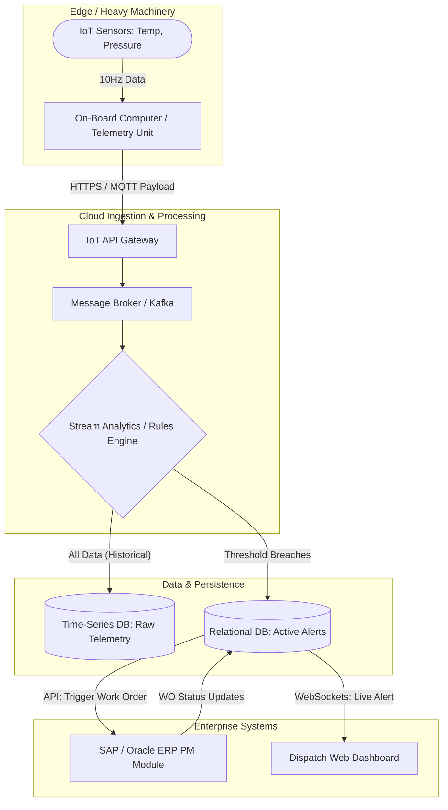

# 🏗️ End-to-End System Architecture: Hardware to ERP

This flow maps how high-frequency physical sensor data is ingested, processed, and routed to trigger automated business logic in the enterprise ERP.

