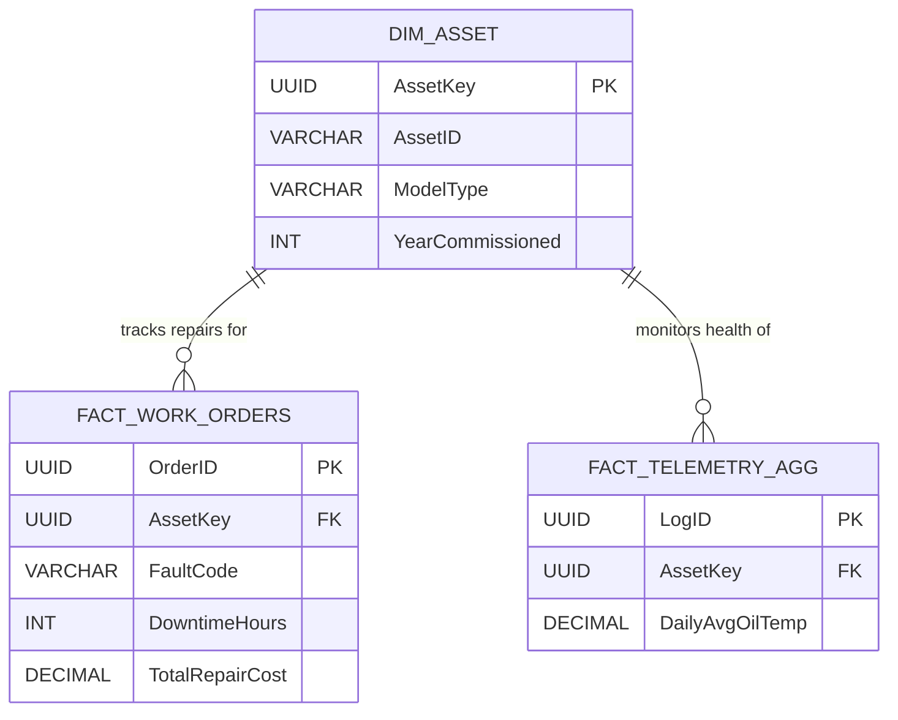

# 📊 Power BI Semantic Model & Advanced DAX

To support the Engineering Reliability Dashboard, data is modeled into a highly optimized Star Schema, enabling fast historical trend analysis and Mean Time Between Failures (MTBF) calculations.

## 1. Analytics Star Schema (De-normalized)



## 2. Core Business Measures (DAX)
**Total Unplanned Downtime (Hours)**
Calculates hours lost strictly to emergency, condition-based failures.

Code snippet

```
Total Unplanned Downtime = 
CALCULATE(
    SUM(FACT_WORK_ORDERS[DowntimeHours]),
    FACT_WORK_ORDERS[WorkOrderType] = "EMERGENCY_PREDICTIVE"
)
```

**Mean Time Between Failures (MTBF - Days)**
Critical engineering KPI determining average operational days before a fault.

Code snippet

```
MTBF_Days = 
VAR TotalOperationalDays = COUNTROWS(FACT_TELEMETRY_AGG)
VAR TotalFailures = COUNTROWS(FACT_WORK_ORDERS)
RETURN DIVIDE(TotalOperationalDays, TotalFailures, 0)
```
