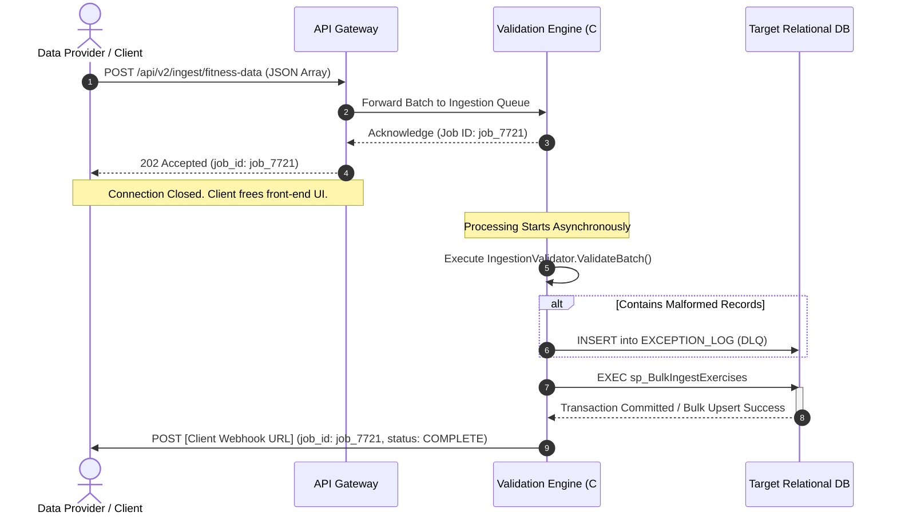

# ⏱️ Asynchronous API Ingestion Sequence

This sequence details the interactions between systems during a high-volume batch upload, from initial validation to the final completion webhook.

```mermaid
sequenceDiagram
    autonumber
    actor Client as Data Provider / Client
    participant API as API Gateway
    participant Valid as Validation Engine (C#)
    participant DB as Target Relational DB

    Client->>API: POST /api/v2/ingest/fitness-data (JSON Array)
    API->>Valid: Forward Batch to Ingestion Queue
    Valid-->>API: Acknowledge (Job ID: job_7721)
    API-->>Client: 202 Accepted (job_id: job_7721)
    Note over Client, API: Connection Closed. Client frees front-end UI.

    Note over Valid: Processing Starts Asynchronously
    Valid->>Valid: Execute IngestionValidator.ValidateBatch()

    alt Contains Malformed Records
        Valid->>DB: INSERT into EXCEPTION_LOG (DLQ)
    end

    Valid->>DB: EXEC sp_BulkIngestExercises
    activate DB
    DB-->>Valid: Transaction Committed / Bulk Upsert Success
    deactivate DB

    Valid->>Client: POST [Client Webhook URL] (job_id: job_7721, status: COMPLETE)
```
