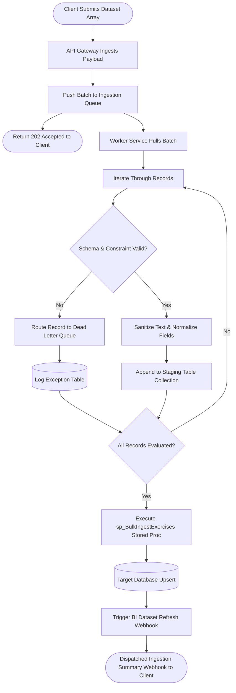

# 🔄 Asynchronous ETL Pipeline Flow

This diagram illustrates how data passes from client endpoints through the validation engine, highlighting asynchronous branching logic and Dead Letter Queue routing.

