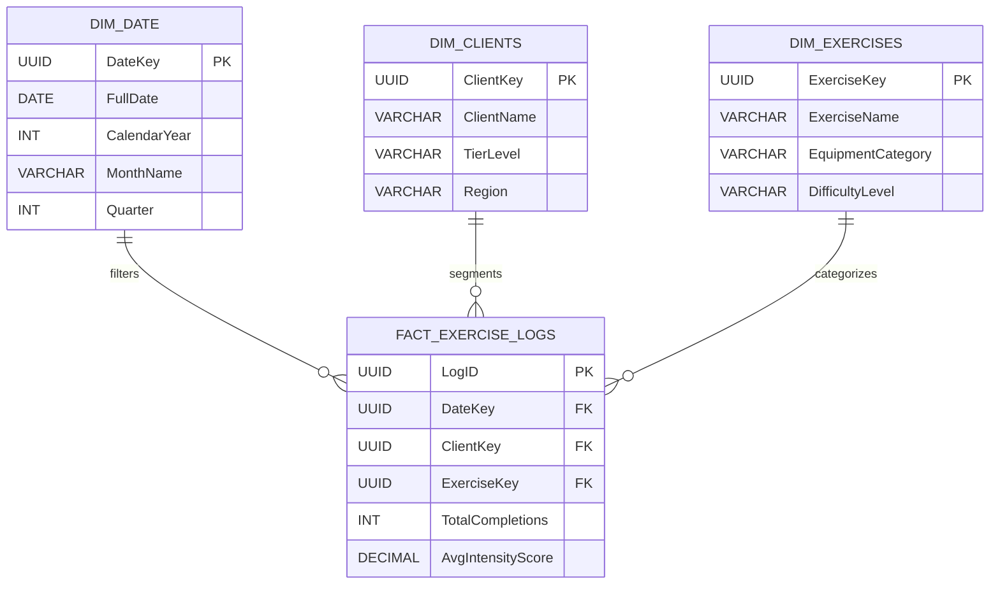

# 📊 Power BI Analytics Star Schema Model

To optimize report rendering and eliminate complex relational queries, the ingested FitnessExerciseDB data is transformed into a highly efficient Star Schema within the analytics presentation layer.

## Architectural Design

## Data Model Best Practices Applied

- **De-normalization:** Avoided snowflake schemas by embedding equipment categories directly into the DIM_EXERCISES table, drastically minimizing SQL join overhead during dashboard refreshes.
- **Time-Intelligence:** Integrated a dedicated DIM_DATE table to allow enterprise users to perform seamless Month-over-Month (MoM) usage velocity analytics.
